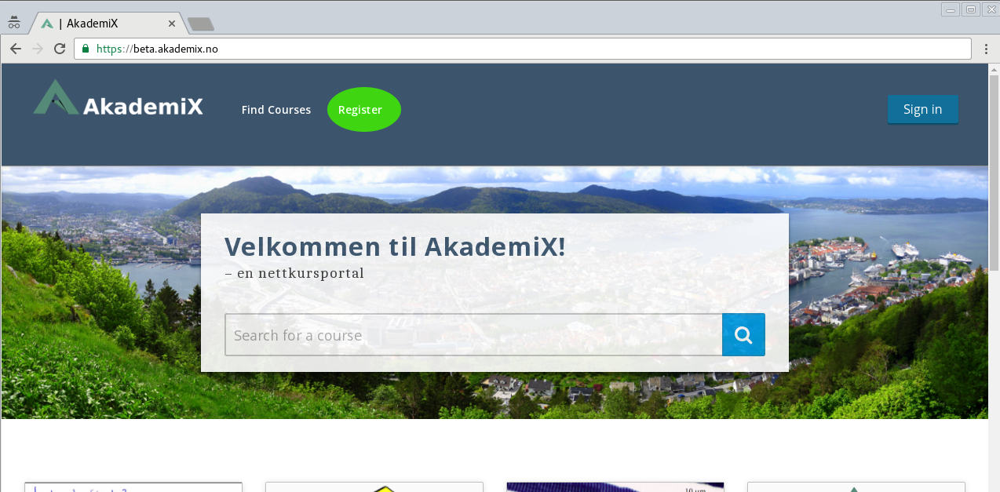

# Oppgave 1

### Hva lærer du?
* Hvordan opprette konto på AkademiX
* Hvordan bli kursutvikler på AkademiX

### a)
Gå til https://beta.akademix.no. Dersom du ikke har registrert deg tidligere, trykk på "Register". 

Bruk registreringsskjema, Facebook eller LinkedIn for å opprette en bruker. Du får en epost med en lenke du må trykke på for å aktivere din konto. Pass på å sjekke korrekt epost (den du brukte når du registrerte deg). Sjekk spam-katalogen dersom eposten ikke dukker opp innen et minutt eller to.

### b)
Gi beskjed til Alexander når du har aktivert din bruker. Han sørger for å oppgradere deg til kursutvikler.

### c)

Gå til [AkademiX Studio](https://beta.akademix.no:18010). Har du fullført Oppgave b) finner du ditt eget personlige testkurs her (etter at du har logget inn). Det er dette kurset du skal bruke resten av workshopen. 

## Neste
Gå tilbake til [startsiden](../README.md#oppgaver) og velg Oppgave 2.
