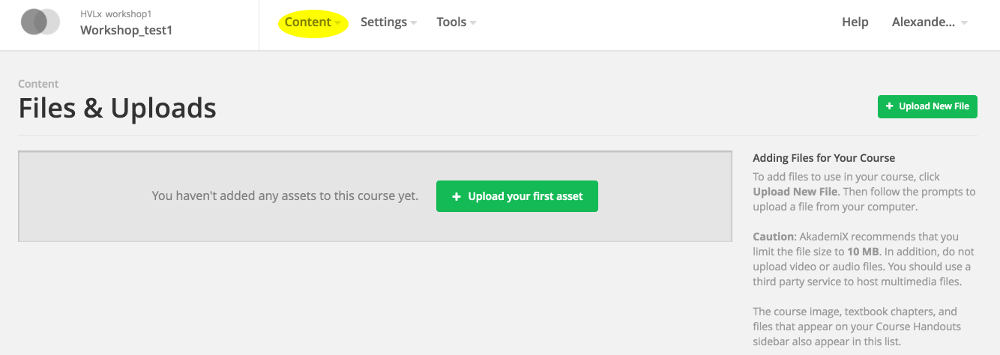

# Oppgave 10

### Hva lærer du?
* Hvordan legge til filer i kurset
* Hvordan legge til handouts

### a)

(i) Bilder og dokumenter kan legges til i kurset ved å bruke **Files & Uploads** i Studio:



Last opp en valgfri fil i kurset ditt, og link til den i en HTML-blokk. Om det er et bilde kan det embeddes i HTML ved å bruke en ""-tag.

(ii) Et alternativ til å laste opp filer til serveren er å bruke linker til Dropbox e.l. Sørg for at dokumentene du lenker til er aksesserbare ("public"). Maksimal filstørrelse i Studio er 50 MB. Om du vil legge til større filer i kurset ditt er Dropbox, Box, YouTube, SoundCloud og lignende veien å gå.

Forsøk å legge til en fil via en ekstern URL.


### b)

"Handouts" vises på kursets hovedside. De kan legges til via Studio. Trykk **Content** og **Updates**. Dersom du har lastet opp handouts via **Files & Uploads** legges de til på følgende måte:
```
<p><a href="/static/pensum_2016.pdf" target="_blank">Pensum</a></p>
<p><a href="/static/ordliste_v2.pdf" target="_blank">Ordliste</a></p>
```
Du kan eventuelt bruke en ekstern URL etter *href=*.

Forsøk å laste opp en handout.


### Ekstra

Gå tilbake til [startsiden](../README.md#oppgaver) og velg Oppgave 11.
