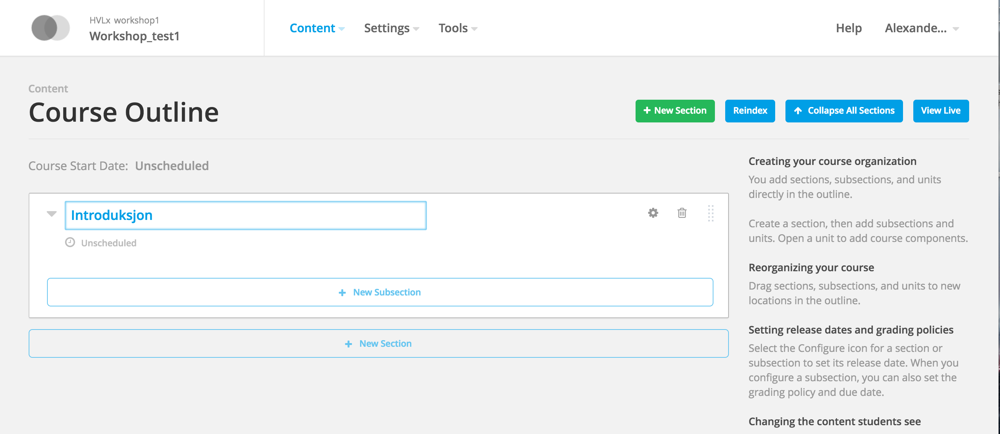
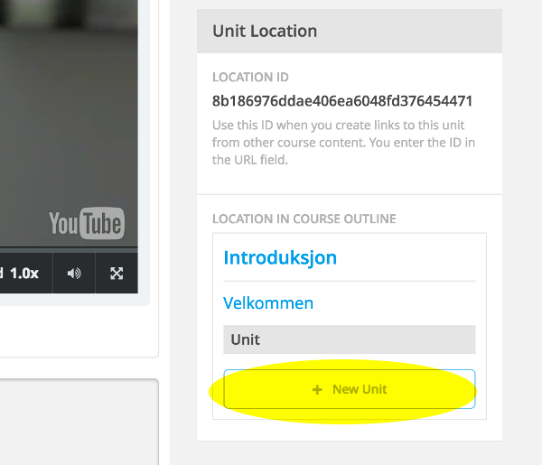

# Oppgave 1

### Hva lærer du?
* Hvordan opprette seksjoner og moduler i kurset
* Hvordan legge til en video og tekst (HTML)
* Hvordan legge til en multiple choice-oppgave

### a)

(i) Logg inn på ditt testkurs i [AkademiX Studio](https://beta.akademix.no:18010).

(ii) Trykk på knappen "+ New Section" og velg et navn på seksjonen (f.eks. "Introduksjon")

(iii) Trykk på knappen "+ New Subsection" og velg et navn på seksjonen (f.eks. "Velkommen")

(iv) Trykk på knappen "Publish" og deretter "Preview". Du blir da sendt til kurs-siden. Her ser du hva du har laget hittil, sett fra studentenes side. Ikke veldig spennende da det ikke er noe innhold. Det kommer i Oppgave b).

### b)

(i) Gå tilbake til AkademiX Studio-vinduet du har åpent. Trykk på knappen "+ New Unit", og deretter "Video" under "Add New Component". En "Placeholder"-video blir da lagt til. Behold denne foreløpig. Trykk på blyantsymbolet øverst på siden og velg et navn (f.eks. Introduksjonsvideo) 

(ii) Velg "+ New Unit" i menyen helt nederst til venstre

(iii) Bytt navn på denne enheten via blyant-symbolet (f.eks. "Informasjon om kurset"). Trykk på "HTML"-knappen og velg "Text".

(iv) "Velg "Publish" og deretter "Preview" for å se hva du har laget så langt. Du får opp noe som ligner dette:

### c)

La oss endre videoen og sette inn noe tekst. 

Trykk her for en rekke eksempler på videoer og tekst du kan bruke til å fylle kurset ditt (skal ta i bruk denne samlingen i alle oppgavene fremover): 
[Workshop_samling](../ressurser.md).

(i) 

(ii)

### d)

Hvordan legge til oppgaver i kurset.

### Ekstra

Det er fritt frem å eksperimentere litt med AkademiX Studio før du går tilbake til [startsiden](../README.md) og velger Oppgave 3.