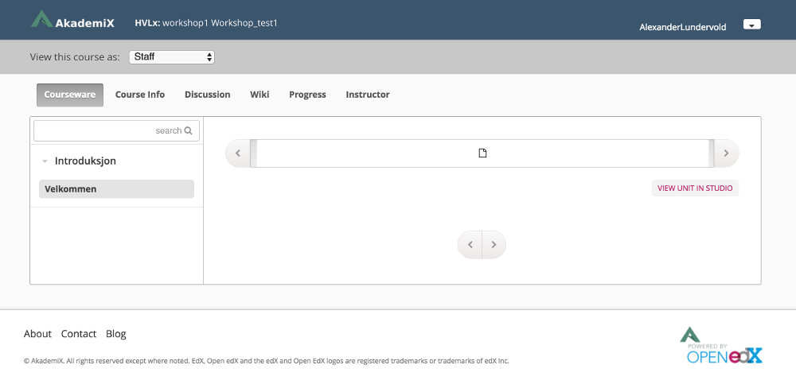
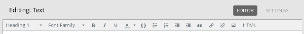
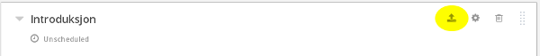

# Oppgave 2

### Hva lærer du?
* Hvordan opprette seksjoner og moduler i kurset
* Hvordan legge til en video og tekst (HTML)
* Hvordan legge til en multiple choice-oppgave


### a)

(i) Logg inn på ditt testkurs i [AkademiX Studio](https://beta.akademix.no:18010).

----
(ii) Trykk på knappen **+ New Section** og gi et navn til seksjonen (f.eks. "Introduksjon")


----
(iii) Trykk på knappen **+ New Subsection** og gi et navn til seksjonen (f.eks. "Velkommen"). Trykk så på **+ New Unit**.

----
(iv) Trykk på knappen **Publish** i boksen til høyre og deretter **Preview**. Du blir da sendt til kurs-siden. Her ser du hva du har laget hittil, sett fra studentenes side. Ikke veldig spennende da det ikke er noe innhold. Innholdet legges til i Oppgave b).



### b)

(i) Gå tilbake til AkademiX Studio-fanen i nettleseren. Velg **Video** under **Add New Component** i enheten du laget i forrige oppgave. En default-video blir da lagt til. Behold denne foreløpig. Trykk på blyantsymbolet øverst på siden for å velge et navn på enheten (f.eks. Introduksjonsvideo). Trykk deretter **Publish**.

----
(ii) Velg **+ New Unit** i menyen helt nederst til høyre


----
(iii) Gi et navn til denne enheten (f.eks. "Informasjon om kurset"). Trykk på **HTML**-knappen og velg **Text**.

----
(iv) Trykk på **Edit**-knappen (ved siden av øyet). Du får da opp en teksteditor. Skriv f.eks. "Placeholder" her. Vi skal bytte ut teksten senere. Trykk **Save**, og **Publish**.

----
(v) Trykk på **+ New Unit** i menyen nederst til høyre. Gi et navn til denne (f.eks. "Spørsmål"). Trykk på den grønne **Problem**-knappen og velg **Multiple Choice**. Trykk deretter **Publish**.

----
(vi) Trykk på **Preview** for å se hva du har laget så langt. Du får opp noe som ligner dette:


Trykk på pilen til venstre to ganger. Studentene som tar kurset møter først denne videoen. Etter å ha sett den trykker de på pilen til høyre og kommer til tekst-blokken vi la inn. Til slutt møter de vårt flervalgsspørsmål. 

### c)

La oss endre video, tekst og oppgave.

Trykk her for en rekke eksempler på videoer og tekst du kan bruke til å fylle kurset ditt med innhold (vi skal ta i bruk denne samlingen i alle oppgavene fremover): 
[Ressurser til workshop](../Ressurser/ressurser.md#ressurser). Du kan eventuelt finne video og tekstinnhold på egen hånd, men *ikke bruk mye tid på dette*. Vårt fokus i dag er ikke innhold, men rammeverket.

(i) Gå tilbake til video-enheten. Trykk på **EDIT**-knappen:


Bytt ut **Default Video URL** med en video fra [Ressurser til workshop](../Ressurser/ressurser.md#ressurser). Trykk **Publish**.

----
(ii) Gå til tekstenheten etter videoen ("Informasjon om kurset"). Trykk **EDIT** og skriv en kort tekst med informasjon om ditt kurs. For eksempel basert på følgende mal:

```
Om kurset [dette kan gjerne settes til "Heading 1"]

[Kort intro til hva kurset handler om]

Innholdsfortegnelse ["Heading 2"]

[Fremdriftsplan]

```

Eksperimenter litt med menyvalgene i editoren:


----
(iii) Gå til den siste enheten i modulen. Velg **EDIT** i flervalgsspørsmålet du la inn i Oppgave 2. Erstatt oppgaveteksten med noe passende. Du kan fjerne alt frem til ">>". Korrekt svar er markert med en "x".

Se [MC-dokumentasjonen](http://edx.readthedocs.io/projects/edx-partner-course-staff/en/latest/exercises_tools/multiple_choice.html) for mer om denne typen spørsmål.

Trykk på **Content** og deretter **Outline** i header-menyen. Trykk så på **Publish** på upubliserte innholdsblokker:



Velg deretter **View Live**.


### Ekstra

Du må gjerne eksperimentere litt med AkademiX Studio før du går tilbake til [startsiden](../README.md#oppgaver) og velger Oppgave 3.
