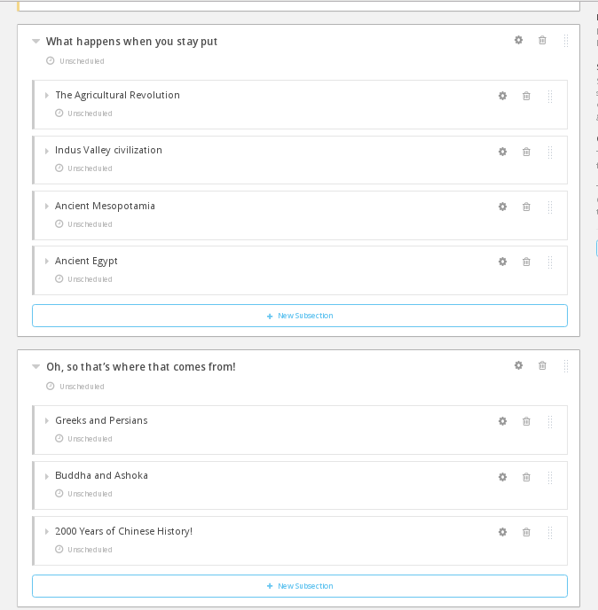

# Oppgave 3

### Hva lærer du?
* Bruk det du lærte i forrige oppgave til sette opp rammeverket til et komplett minikurs
* Legge til obligatoriske oppgaver, deleksamen og avsluttende eksamen

### a)

(i) Gå tilbake til Studio-fanen. Trykk på "Conten"-menyen helt øverst og velg "Outline". Velg "+ New Subsection" og kall denne "Hva skal vi lære?".

(ii) Legg til nye seksjoner via "+ New Section"-knappen og underseksjoner via "+ New Subsection" til du har noe som ligner dette:

(iii)

### Ekstra

Du må gjerne eksperimentere litt med AkademiX Studio før du går tilbake til [startsiden](../README.md#oppgaver) og velger Oppgave 4.
