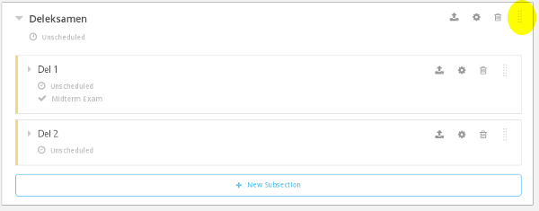
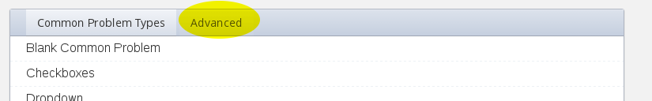
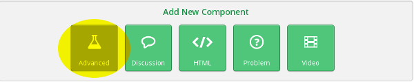
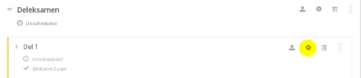

# Oppgave 3

### Hva lærer du?
* Bruk det du lærte i forrige oppgave til sette opp rammeverket til et komplett minikurs
* Legge til obligatoriske oppgaver, deleksamen og avsluttende eksamen

### a)

(i) Gå tilbake til Studio-fanen. Trykk på **Content**-menyen helt øverst og velg **Outline**. Velg **+ New Section** og gi den et navn (for eksempel "What happens when you stay put").

----
(ii) Legg til nye seksjoner via **+ New Section**-knappen og underseksjoner via **+ New Subsection** til du har noe som ligner dette. Hva du kaller seksjonene er valgfritt. Du kan f.eks. forsøke å gjenskape et av kursene lenket til under [Ressurser til workshop](../Ressurser/ressurser.md). Følgende er fra Khan Academy / Crash Course:

----
(iii) Legg til **Units** inne i seksjonene etter eget ønske. Videoer kan hentes fra [Ressurser til workshop](../Ressurser/ressurser.md). 

### b)

(i) Legg til en seksjon kalt "deleksamen" midt i kurset. Merk: Seksjoner kan ommøbleres ved å dra i høyre ende av seksjonsboksene.

Legg til noen **Units** med spørsmål i eksamen. Trykk på **Problem** under **Add New Component**. Her får du opp vanlige spørsmålstyper. Under fanen kalt **Advanced** finner du mer.

Du finner også spørsmålstyper ved å trykke på **Advanced**-knappen under **Add New Component**. 

Se [dokumentasjonen](http://edx.readthedocs.io/projects/edx-partner-course-staff/en/latest/exercises_tools/index.html) for mer om de ulike oppgavetypene.

----
(ii) Gå tilbake til **Content** --> **Outline**. Under **Deleksamen**, velg settings på hver av underseksjonene.

Under **Grade as:** kan du sette at seksjonen skal være en **Midterm exam**.

----
(iii) Tilsvarende kan gjøres med andre oppgaver i kurset ditt. Du kan f.eks. velge at de skal regnes som **Homework**.

Legg til en avsluttende eksamen (**Grade as: Final exam**).

----
(iv) Gå tilbake til **Content** --> **Outline** og sørg for at alt innhold er publisert. Trykk deretter **View live**. Du har nå rammeverket til et komplett kurs.

### Ekstra

Du må gjerne eksperimentere litt med AkademiX Studio før du går tilbake til [startsiden](../README.md#oppgaver) og velger Oppgave 4.
