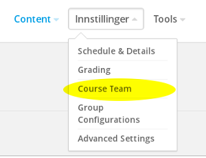
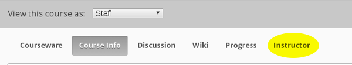

# Oppgave 6

### Hva lærer du?
* Hvordan legge til kursutviklere
* Hvordan legge til studenter

### a)

Legg til en av de andre workshopdeltakerne i **Course Team** for ditt kurs og vice versa.

Sjekk at dere har tilgang til hverandres kurs på [Studio-hjemmesiden](https://beta.akademix.no:18010).

### b)

Studenter legges til gjennom kurssiden, ikke i Studio. Gå til https://beta.akademix.no, logg inn, og gå inn på kurset ditt.

Trykk på **Instructor**:

Under **MEMBERSHIP** finner du funksjonalitet for å legge til studenter (og "Staff"). Legg til et par studenter (blant workshop-deltakerne eller andre).

### Ekstra

Du må gjerne eksperimentere litt med **Instructor**-siden før du går tilbake til [startsiden](../README.md#oppgaver).
