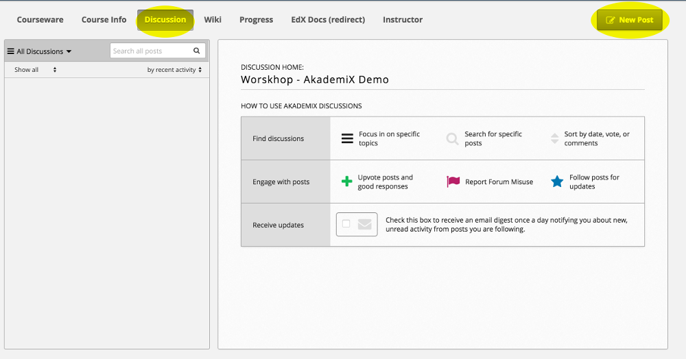
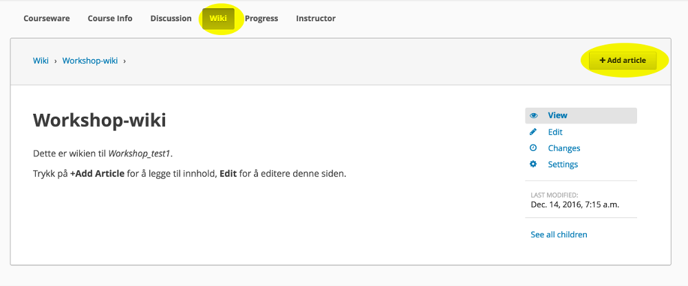

# Oppgave 9

### Hva lærer du?
* Hvordan bruke kursforumet
* Hvordan bruke kurswikien

### a)

(i) Hvert kurs på AkademiX har sitt eget kursforum, tilgjengelig for alle kursdeltakere.



Legg til et nytt innlegg ved å trykke **New Post**.

(ii) For å legge til nye diskusjonstema (i tillegg til "General") gå til Studio, trykk **Advanced Settings**, naviger til **Discussion Topic Mapping** og skriv inn:
```
{
   "Generelt": {
       "id": "course"
   },
   "Spørsmål om kurset": {
        "id": "course_q"
   }
}
```

**Legge til kategorier**


#### Dokumentasjon
Du finner mer om forum-funksjonaliteten [her](http://edx.readthedocs.io/projects/open-edx-building-and-running-a-course/en/latest/manage_live_course/discussions.html).

### b)

(i) Det er også en innebygget kurswiki som alle studenter kan editere (hvis ikke annet er spesifisert under **Advanced Settings**)



Legg til en ny artikkel ved å trykke **+ Add article**.

Wikien kan f.eks. brukes til FAQs, dele kursinformasjon, dele nyttige ressurser, errata, samle tilbakemeldinger, etc.

(ii) For å deaktivere wikien, gå til Studio, velg **Content** og deretter **Pages**. Trykk på "øyet" i Wiki-raden.

#### Dokumentasjon
Du finner mer om wiki-funksjonaliteten [her](http://edx.readthedocs.io/projects/open-edx-building-and-running-a-course/en/latest/course_assets/course_wiki.html).


### Ekstra

Du må gjerne eksperimentere litt med forum- og wiki-funksjonaliteten før du går tilbake til [startsiden](../README.md#oppgaver) og velger Oppgave 10.
