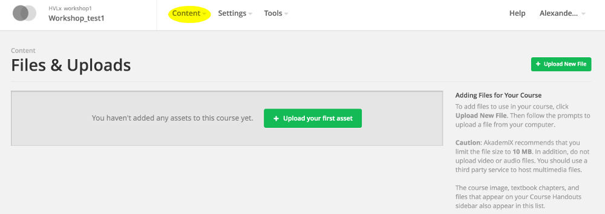

# Task 10

### What you'll learn
* How to add files to the course
* How to add handouts

### a)

(i) Images and documents can be added to the course via **Files & Uploads** in the Studio:



Upload a file to your course and link to it in an HTML block. If it's an image it can be embedded by using an "" tag.

----
(ii) An often better alternative is to link to files uploaded to Dropbox or similar (or S3). Make sure the documents are marked as "public". Otherwise the server cannot access them.

Add a file via an external URL.


### b)

"Handouts" are shown on the main page of the course. They can be added in the Studio. Click **Content** and **Updates**. If you've uploaded handouts via **Files & Uploads** they can be added as follows:
```
<p><a href="/static/pensum_2016.pdf" target="_blank">Pensum</a></p>
<p><a href="/static/ordliste_v2.pdf" target="_blank">Dictionary</a></p>
```

You can use an external URL in the *href=*.


Return to [the start page](../README.md#tasks) and select Task 11.
