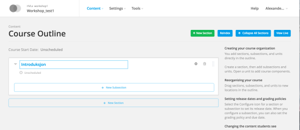
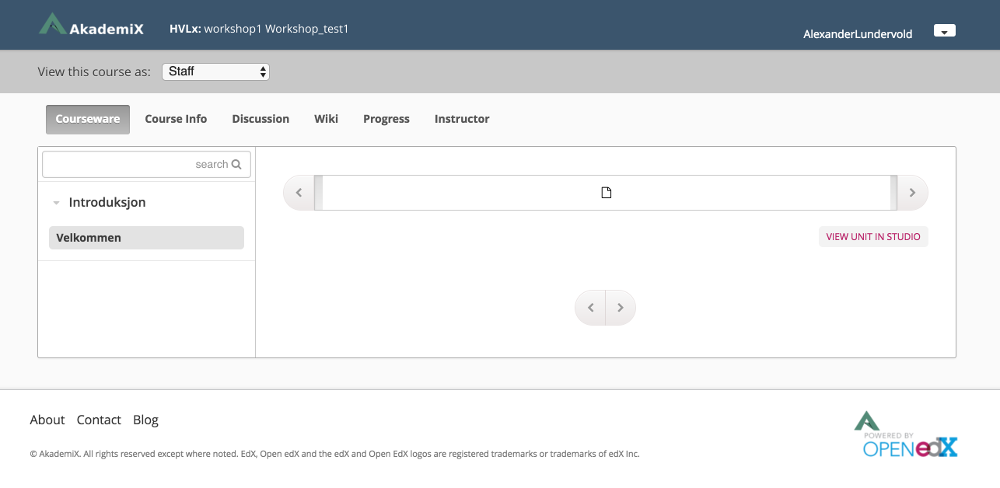
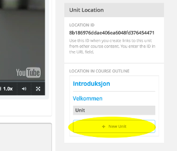
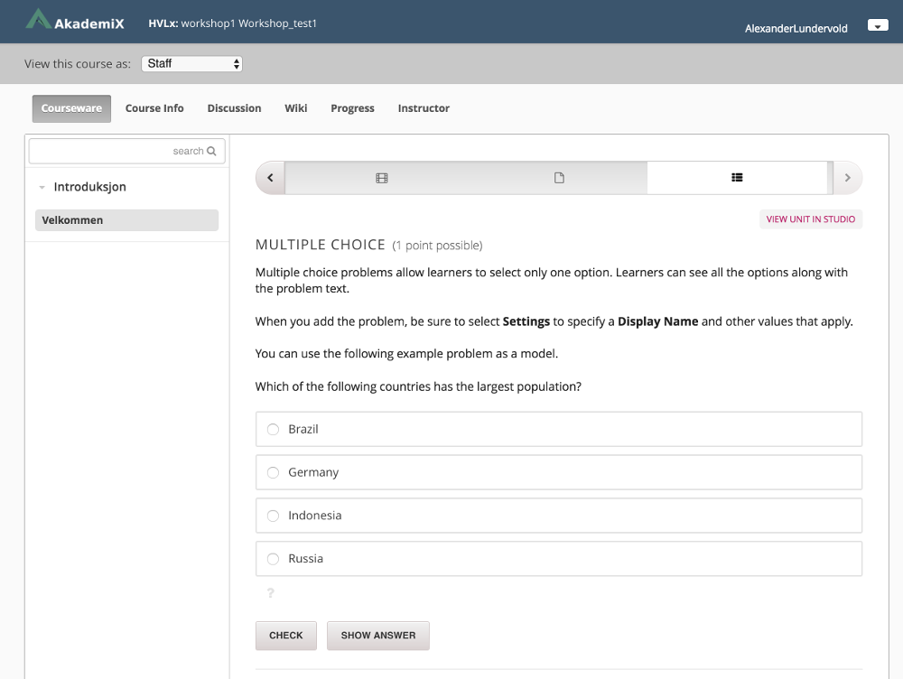
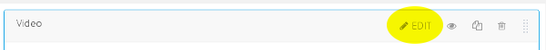
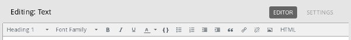
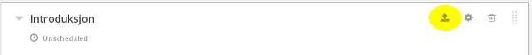

# Task 2

### What you'll learn
* How to create sections and modules in the course
* How to add videos and text to the course
* How to add exercises (a multiple choice exercise, for now)


### a)

(i) Log in to your course in the [AkademiX Studio](https://akademix.no:18010).

----
(ii) Click the button **+ New Section** and name the section (f.ex. "Introduction")



----
(iii) Click the button **+ New Subsection** and provide a name for the subsection (f.ex. "Welcome"). Then click **+ New Unit**.

----
(iv) Click **Publish** in the box on the right-hand side, and then **Preview**. You will be sent to the course page. Here you can see what you've created so far, as it will be seen by the students. Not very exciting yet, because there is no content.. Content will be added in Task b).




### b)

(i) Go back to the AkademiX Studio page in your browser. Select **Vidoe** under **Add New Component** in the Unit you created previously. A default placeholder video will then be added. Keep this for now. Click on the edit symbol at the top of the page to give a name to the Unit (f.ex. Video introduction). Click **Publish**.


----
(ii) Select **+ New Unit** in the menu in the lower right-hand side.



----
(iii) Name the unit (f.ex. "Information about the course"). Click the **HTML** button and choose **Text**.

----
(iv) Click the **Edit** button (next to the eye). A text editor will appear. Write something here (f.ex. "Placeholder"). We'll change the text later. Click **Save** and then **Publish**.

----
(v) Click **+ New Unit** in the menu at the lower right-hand side. Name the unit (f.ex. "Questions"). Click the green **Problem** button and select **Multiple Choice**. Then click **Publish**.

----
(vi) Click **Preview** to see what you've made this far. You should see something like the following:




Click the left arrow twice. The students in the course will see this video first. After watching the video they'll click the arrow to the right and come to the text block we made. Finally, they'll come to our multiple choice question.


### c)

Let's change the video, tesxt and exercise.

Click here for a selection of videos and texts you can use to fill your course with (temporary) content:
[Workshop resources](../Resources/resources.md#resources). Optionally, you can find your own videos and texts. Or even record a presentation in the e-learning station we've set up. 

(i) Go back to the video unit. Click **EDIT**:



Change the **Default Video URL** with a video from [Workshop resources](../Resources/resources.md#resources). Click **Publish**.

----
(ii) Go to the text unit after the video ("Information about the course"). Click **EDIT** and write a short text. You can use the following outline:

```
About the course [this can be set to "Heading 1"]

[A short intro to what the course is about]

Content ["Heading 2"]

[Progress plan]

```

Experiment a bit with the menu options in the editor:


----
(iii) Go to the last unit in the module. Click **EDIT** in the multiple choice question you've added in Task 2. Replace the text with something suitable. You can remove ecerythig up to the ">>". The correct response is marked with an "x".


See [the MC documentation](http://edx.readthedocs.io/projects/edx-partner-course-staff/en/latest/exercises_tools/multiple_choice.html) for more information about this kind of question.

Click **Content** and then **Outline** in the header menu. Then click **Publish** on the unpublished content:



Click **View Live**.


