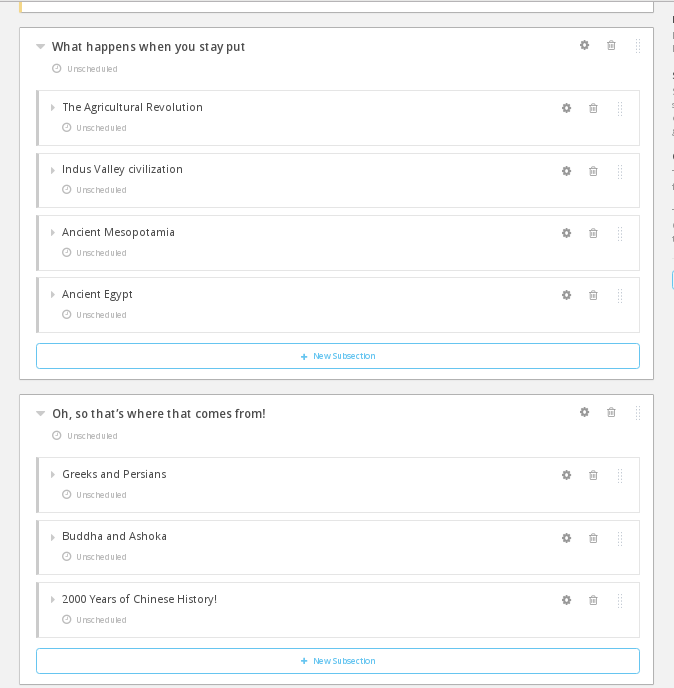
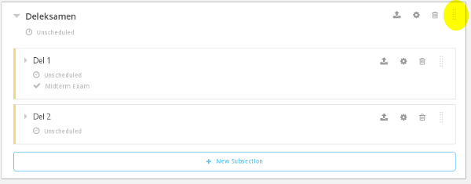
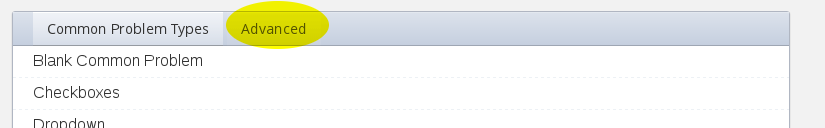
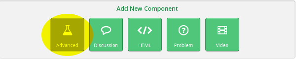
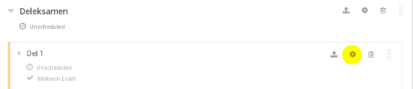

# Task 3

### What you'll learn
* Use what you learned in the previous task to create the framework of an entire (mini) course
* Add obligatory assignments, midterm exam and final exam

### a)

(i) Go back to the Studio tab. Click the **Content** menu at the top and select **Outline**. Click **+ New Section** and give it a name.

----
(ii) Add new sections using the **+ New Section** button, and subsections via **+ New Subsection** until you have more-or-less a complete framework for a course.

----
(iii) Add **Units** inside the sections as you see fit. You can use videos from [Workshop resources](../Resources/resources.md) or elsewhere.  

### b)

(i) Add a section called "midterm" in the middle of the course somewhere. Legg til en seksjon kalt "deleksamen" midt i kurset. Merk: Seksjoner kan ommøbleres ved å dra i høyre ende av seksjonsboksene.

Legg til noen **Units** med spørsmål i eksamen. Trykk på **Problem** under **Add New Component**. Her får du opp vanlige spørsmålstyper. Under fanen kalt **Advanced** finner du mer.

Du finner også spørsmålstyper ved å trykke på **Advanced**-knappen under **Add New Component**. 

Se [dokumentasjonen](http://edx.readthedocs.io/projects/edx-partner-course-staff/en/latest/exercises_tools/index.html) for mer om de ulike oppgavetypene.

----
(ii) Gå tilbake til **Content** --> **Outline**. Under **Deleksamen**, velg settings på hver av underseksjonene.

Under **Grade as:** kan du sette at seksjonen skal være en **Midterm exam**.

----
(iii) Tilsvarende kan gjøres med andre oppgaver i kurset ditt. Du kan f.eks. velge at de skal regnes som **Homework**.

Legg til en avsluttende eksamen (**Grade as: Final exam**).

----
(iv) Gå tilbake til **Content** --> **Outline** og sørg for at alt innhold er publisert. Trykk deretter **View live**. Du har nå rammeverket til et komplett kurs.

### Ekstra

Du må gjerne eksperimentere litt med AkademiX Studio før du går tilbake til [startsiden](../README.md#oppgaver) og velger Oppgave 4.
