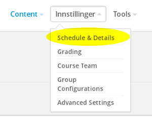
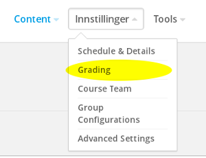

# Oppgave 5

### Hva lærer du?
* Hvordan sette start- og sluttdato
* Hvordan endre innstillinger for karaktersetting
* Legge til kursoppdateringer

### a)

(i) Trykk på **Settings** og deretter **Schedule & Details**

Gjør deg litt kjent med hva som kan endres på denne siden.

----
(ii) Sett startdato og sluttdato for kurset til henholdsvis 01.01.2017 og 30.06.2017. Trykk **Save Changes**.

### b)

Gå til **Settings** --> **Grading**:

Her kan du endre, fjerne og legge til ulike vurderingselementer, samt sette strykgrenser. Fjern alle labøvelser og spesifiser at det skal være fire obligatoriske øvelser. 

### c)

Kursoppdateringer er det første som vises til studenten når han/hun logger inn på kurset via beta.akademix.no. Oppdateringer legges til under **Content** --> **Updates**. Legg til en oppdatering som ønsker velkommen til kurset.

### Ekstra

Trykk på **Settings** --> **Advanced Settings**. Scroll gjennom disse for å bli litt kjent med hvilke innstillinger som er tilgjengelige.

Gå deretter tilbake til [startsiden](../README.md#oppgaver) og velg Oppgave 6.
