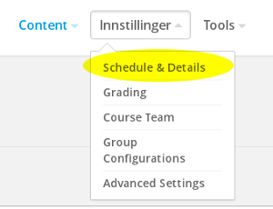

# Task 5

### What you'll learn
* How to set the course start and end dates
* How to adjust grading settings
* How to add course updates

### a)

(i) Click **Settings** and **Schedule & Details**

Have a look around the various settings available on this page.

----
(ii) Adjust the start and end date for the course to 01.11.2017 og 30.02.2018. Click **Save Changes**.

### b)

Go to **Settings** --> **Grading**:

This is where you can change, remove and add various assessment elements, and adjust the passing grade. Specify a suitable number of obligatory exercises.

### c)

Course updates are added via **Content** --> **Updates**. Add an update welcoming the students to the course.

### Ekstra

Click **Settings** --> **Advanced Settings**. Scroll through these to get an overview of what's available.

Return to [the start page](../README.md#oppgaver) and select Task 6.
