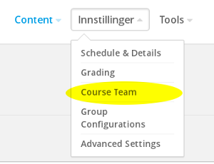
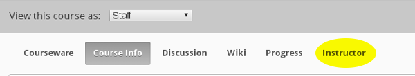

# Task 6

### What you'll learn
* How to add course developers
* How to add students

### a)

Add one of the other workshop participants to the **Course Team**.

Check that you can access each others courses on the [Studio homepage](https://akademix.no:18010).

### b)

(i) Students are added through the course website, not in the Studio. Go to https://akademix.no, log in, and access your course.

Click **Instructor**:

In **MEMBERSHIP** you can add students (and "Staff"). Add a few students (among the workshop participants or others).

Note that if the starting date for the course is in the future, the students cannot log in to the course.

----

(ii) Add a few beta testers and adjust the number of days of beta testing so that the course becomes available for the beta testers. Hint: under **Advanced Settings** in Studio.

### Extra

Feel free to experiment with the **Instructor** page before returning to [the start page](../README.md#tasks).
