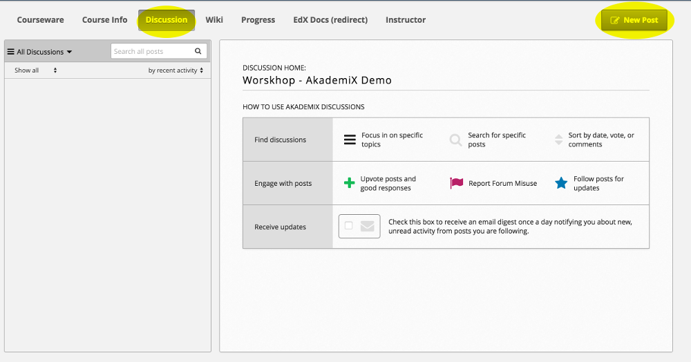
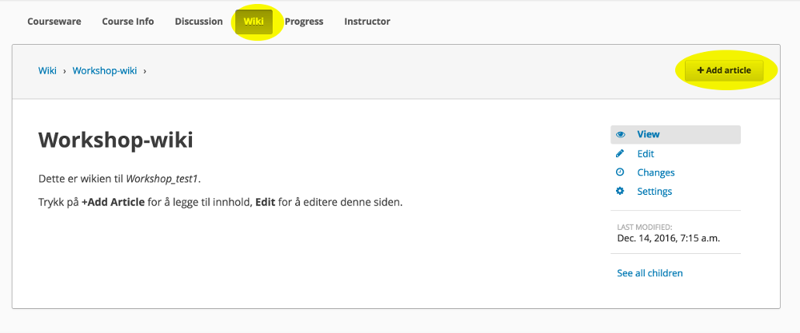

# Task 9

### What you'll learn
* How to use the course forum
* How to use the course wiki

### a)

(i) Each AkademiX course has its own forum, available to all course participants. 



Add a new post via **New Post**.

-----

(ii) To add a discussion topic, go to Studio, click **Advanced Settings**, navigate to **Discussion Topic Mapping** and write:
```
{
   "General": {
       "id": "course"
   },
   "Questions about the course": {
        "id": "course_q"
   }
}
```


#### Documentation
You'll find more information about the forum [here](http://edx.readthedocs.io/projects/open-edx-building-and-running-a-course/en/latest/manage_live_course/discussions.html).

### b)

(i) By default, the course also has an associated wiki, editable by all course participants (unless you specify otherwise under **Advanced Settings**)



Add a new element by clicking **+ Add article**.

The wiki can for example be used for FAQs, sharing course information, useful resouces, errata, gather feedback, etc.


----

(ii) To deactivate the wiki, go to Studio, select **Content** and then **Pages**. Click the "eye" in the Wiki row.

#### Documentation
More about the wiki [here](http://edx.readthedocs.io/projects/open-edx-building-and-running-a-course/en/latest/course_assets/course_wiki.html).


### Extra

Feel free to experiment with the forum and the wiki before returning to [the start page](../README.md#tasks) to select Task 10.
